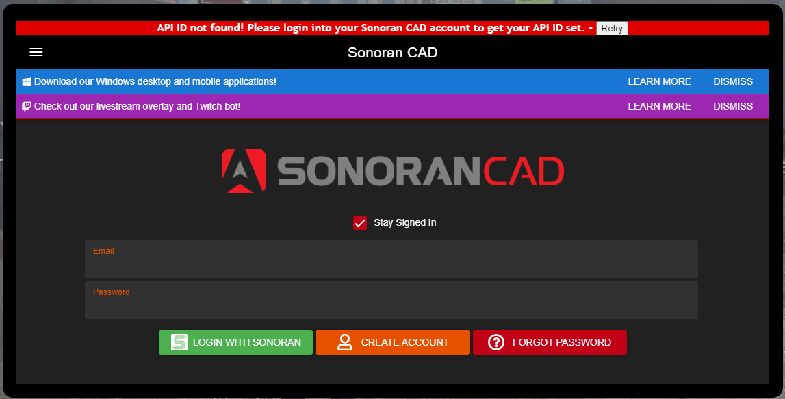

# Registration Process - First Join

#### Welcome to Thin Blue Line RP

We are happy to have you here on our server, where we pride ourselves on Realism.

Please follow the Steps below.

* [ ] Launch FiveM
* [ ] Connect to our Server "Thin Blue Line RP Server 1 | Trained LEO | Active Staff"
* [ ] On the Character Selection Screen - Click Create a new Character (Step 1 Arrow)
* [ ] Then Click Play (Step 2 Arrow)

* [ ] Enter Character Information (Step 3 Arrow)
* [ ] Click Create (Step 4 Arrow)

* [ ] Customize Character Skin (Face, Clothes, Etc)


If Male character does not appear on load, Change Sex to 1 and back to 0



Do not Set Accessory Items (Hats, Chains, Bulletproof Vests, Ear Accessories)


* [ ] Press Enter when complete with editing your character.
* [ ] Should be left with the Nag Message about registering the CAD.

* [ ] Run the following command to open the in-game CAD

> /showcad

.png>)

* [ ] Click Create Account (Step 5 Arrow)

* [ ] Fill in Account Creation Information (Step 6 Arrow)

* [ ] Click Create Account (Step 7 Arrow)

* [ ] Go to your Email Service and Verify your Account
* [ ] Click Cancel (Step 8 Arrow)

* [ ] Enter your Email and Password and Click Login

Once Logged in you Should see this.

* [ ] Click Retry at the Top. (The alert should disappear.)
* [ ] Click above the CAD and Press Escape.
* [ ] Run the command /verifycad - The Nag Message should go away.

Next we will need to get your Civilian Access

* [ ] Run the command /showcad
* [ ] Click the 3 lines at Top Left
* [ ] Click Settings
* [ ] Scroll down to the Account Secret ID
* [ ] Reveal and Copy the Account Secret ID
* [ ] Goto Our Discord
* [ ] Goto the Bot Commands Channel
* [ ] Type /linkme - Press Space - Paste the Secret
* [ ] Press enter
* [ ] Goto the Reaction Roles channel and react to the message to get your Civilian Role
* [ ] Go back to the Bot Commands channel
* [ ] Type /syncme

You should now have your Civilian Access in the CAD to edit your Civilian Information. For further information and instruction please reach out to server staff.
