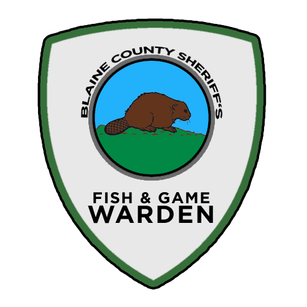

# SOP - Fish And Game Warden

> Version 1.00 (Last Updated 00/00/2022)


**NOT FINAL COPY**


### Enrollment Requirements into **FGW**

* Must be a Deputy III or higher. Reserves permitted.
* Must be in good standing within TBLRP (No Points).
* Must be in good standing with the department.
* Must be active and well-mannered in patrols.
